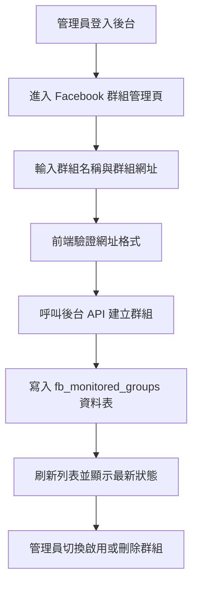

## 1. 產品概述
為日日寵後台建立一個「Facebook 監控群組管理基地」，讓管理員可以自行新增、停用、刪除需要監控的 Facebook 尋寵群組。
- 核心目標是為後續「自動抓取 Facebook 尋寵貼文並交由 AI 識別」功能建立可維護、可擴充的監控來源清單。
- 功能價值在於把原本分散、人工維護的群組來源集中到後台管理，降低營運成本並提升資料來源穩定性。

## 2. 核心功能
### 2.1 使用者角色
| 角色 | 註冊方式 | 核心權限 |
|------|----------|----------|
| 管理員 | 既有 Supabase 後台登入 | 新增、查看、啟用/停用、刪除 Facebook 監控群組 |

### 2.2 功能模組
1. **Facebook 群組管理頁**：群組新增表單、監控群組列表、狀態切換、刪除操作。
2. **管理 API 模組**：提供監控群組的新增、讀取、切換啟用狀態、刪除能力。
3. **資料表模組**：儲存監控群組名稱、網址、是否啟用與建立時間。

### 2.3 頁面細節
| 頁面名稱 | 模組名稱 | 功能說明 |
|-----------|-------------|---------------------|
| Facebook 群組管理頁 | 新增表單 | 輸入群組名稱與 Facebook 群組網址，驗證後送出建立新監控來源 |
| Facebook 群組管理頁 | 監控群組列表 | 顯示所有已建立群組、建立時間、網址與啟用狀態 |
| Facebook 群組管理頁 | 狀態切換 | 管理員可快速啟用或停用單一群組監控 |
| Facebook 群組管理頁 | 刪除操作 | 管理員可移除不再需要監控的 Facebook 群組 |

## 3. 核心流程
管理員登入後台，進入 Facebook 群組管理頁，新增要監控的群組網址；建立成功後群組會出現在列表中。管理員之後可隨時切換是否啟用監控，或刪除不再使用的來源。

## 4. 使用者介面設計
### 4.1 設計風格
- 主色系：延續後台現有白底、石板灰文字、紅色重點操作的簡約風格
- 按鈕風格：大圓角膠囊或圓角卡片式按鈕，維持高質感陰影與輕量 hover
- 字體與尺寸：沿用系統現有粗體標題與清晰表單字級
- 版面風格：桌面優先的卡片式控制台布局，上方輸入，下方列表
- 圖示建議：使用簡潔 emoji 或 lucide 風格圖示輔助理解

### 4.2 頁面設計概覽
| 頁面名稱 | 模組名稱 | UI 元素 |
|-----------|-------------|-------------|
| Facebook 群組管理頁 | 頂部標題區 | 頁面標題、副標說明、功能定位文案 |
| Facebook 群組管理頁 | 新增表單卡片 | 兩個輸入欄位、主要操作按鈕、錯誤提示與提交狀態 |
| Facebook 群組管理頁 | 監控清單卡片 | 表頭、群組資訊、網址連結、啟用開關、刪除按鈕、空狀態 |

### 4.3 響應式
- 採用桌面優先設計
- 桌面版使用雙卡片層級與表格化列表
- 手機版改為直向卡片堆疊，按鈕與欄位維持可點擊尺寸
