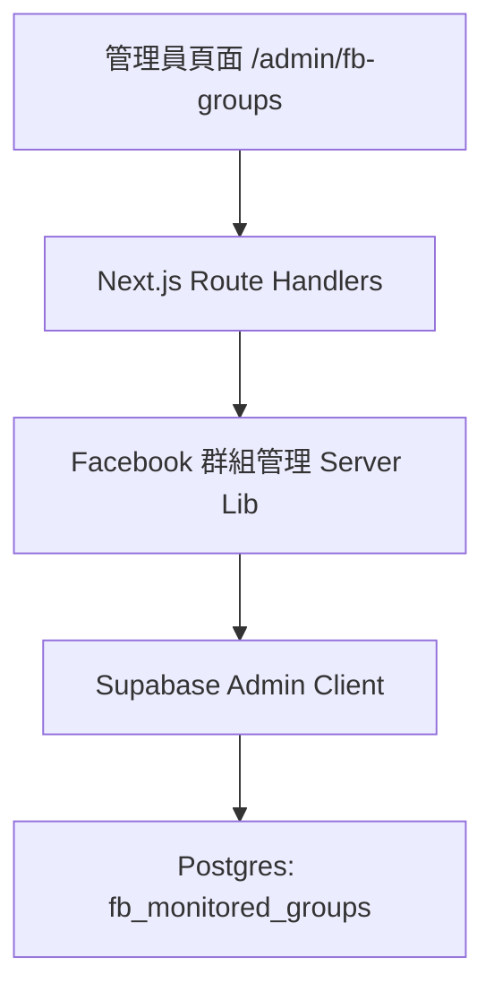
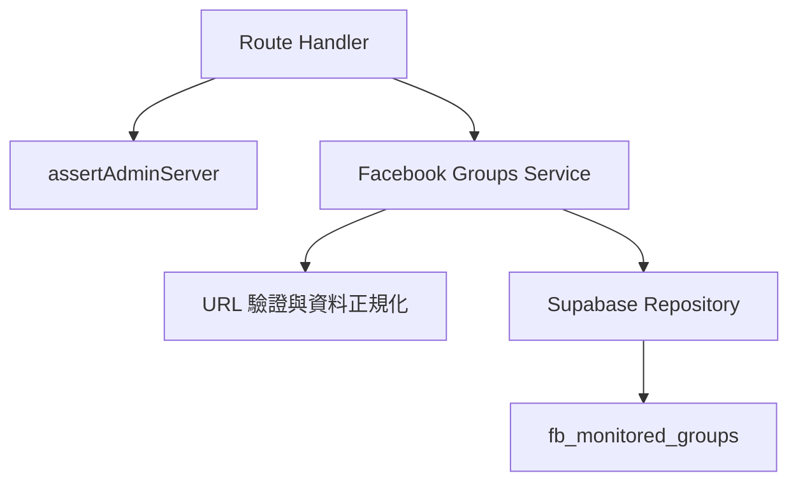
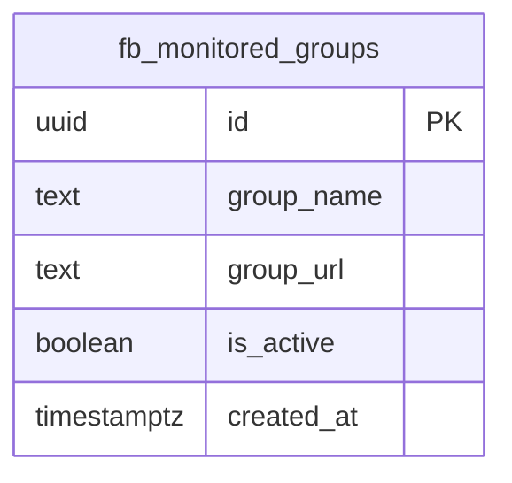

## 1. 架構設計


## 2. 技術說明
- 前端：Next.js 16 App Router + React 19 + Tailwind CSS 4
- 後端：Next.js Route Handlers
- 資料層：Supabase Postgres + `@supabase/supabase-js`
- 權限：沿用 `assertAdminServer()` 驗證管理員身份

## 3. 路由定義
| 路由 | 用途 |
|-------|---------|
| `/admin/fb-groups` | Facebook 監控群組管理頁 |
| `/api/admin/fb-groups` | 讀取與建立監控群組 |
| `/api/admin/fb-groups/[id]` | 更新單一群組啟用狀態與刪除單一群組 |

## 4. API 定義
```ts
type FbMonitoredGroup = {
  id: string;
  group_name: string;
  group_url: string;
  is_active: boolean;
  created_at: string;
};

type CreateFbGroupBody = {
  group_name: string;
  group_url: string;
};

type UpdateFbGroupBody = {
  is_active?: boolean;
};
```

- `GET /api/admin/fb-groups`
  - 回傳 `{ groups: FbMonitoredGroup[] }`
- `POST /api/admin/fb-groups`
  - 請求：`CreateFbGroupBody`
  - 驗證：網址必須是 `facebook.com/groups/...` 或 `fb.com/groups/...`
  - 回傳：`{ group: FbMonitoredGroup }`
- `PATCH /api/admin/fb-groups/[id]`
  - 請求：`UpdateFbGroupBody`
  - 回傳：`{ group: FbMonitoredGroup }`
- `DELETE /api/admin/fb-groups/[id]`
  - 回傳：`{ success: true }`

## 5. 伺服器架構圖


## 6. 資料模型
### 6.1 資料模型定義


### 6.2 資料定義語言
```sql
create table if not exists public.fb_monitored_groups (
  id uuid primary key default gen_random_uuid(),
  group_name text not null,
  group_url text not null unique,
  is_active boolean not null default true,
  created_at timestamptz not null default timezone('utc', now())
);

create index if not exists fb_monitored_groups_active_idx
  on public.fb_monitored_groups (is_active, created_at desc);

alter table public.fb_monitored_groups enable row level security;
```
